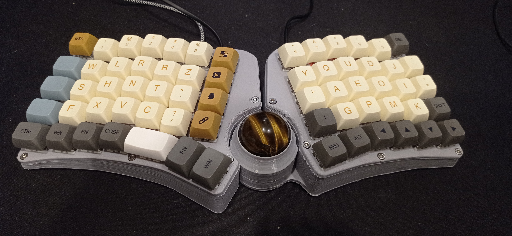
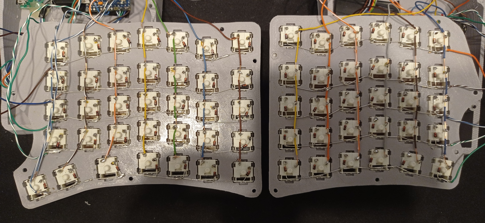
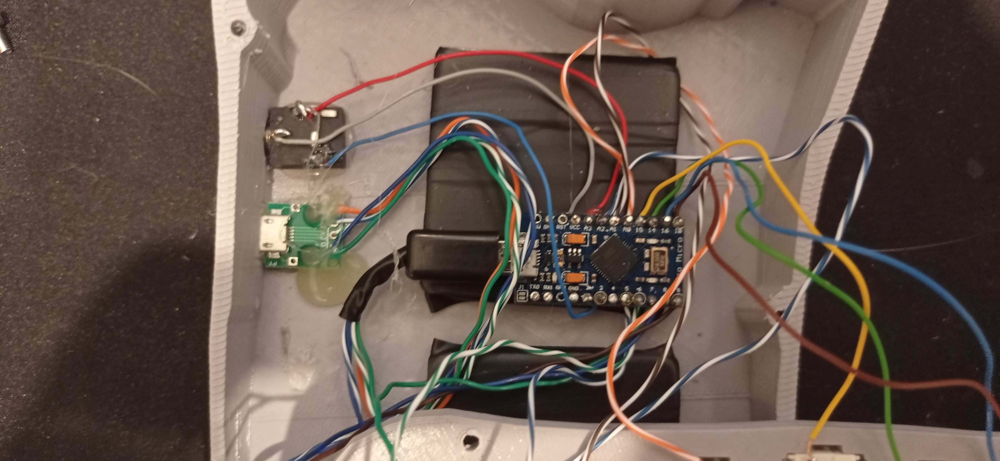

New Ergo keyboard is an attempt to build a keyboard that would fit my needs as a daily use keyboard.

In key principles the keyboard layout was taken from the halmak layout and adjusted to fit my needs and habits.

In terms of keyboard layout I separated the top row (numbers) from the main typing area as well as the outer keys to avoid key compression (also I have big hands so I prefer to move shift, tab and control away from the rest of the keys).



## Materials

2x Arduino Pro-Micro

2x TRSS port

65 * 1N4148 diode

1x PWM3360 sensor (trackball) - https://www.tindie.com/products/citizenjoe/pmw3360-motion-sensor/

some ethernet wire for connecting everything together

keyboard case and keys grid plate - https://www.thingiverse.com/thing:6451825

65 * cherry-mx compatible keyswitches (I use gateron red/black mix)

**14x** M3x15mm bolts for case (not longer than 20mm long)

**3x** M5x15mm bolts for trackball bearings

**3x** M5x4mm ball bearings for trackball

micro-usb - usb cable

3.5mm jack-jack cable

keycaps 

## Board Wiring 
Handwiring guide: https://docs.qmk.fm/#/hand_wire

Wiring diagram overview (expectation)


Wiring (reality)
Important thing, as you can see, the rows are wired in a way that they are connected to the board from the center of the keyboard, not the outside. This wiring direction needs to be followed to match then the keyboard layout in the firmware configuration.



Hot glued arduino board to the bottom of the case so it does not move, wires enter the board from the bottom.


Trackball sensor is wired with cables entered from the sensor side and cut down as short as possible. Be patient here with the soldering, the cables will eventually fit, but it is all very tight there. make more room if you feel that you need it (drill is your friend or modify the model accordingly). 

If your mouse cursor is nervous, twitching and moving around excessively, the distance is most likely wrong.

If the sensor is not reacting to anything, wiring is bad or ball is too far or too close (test with finger hovering above the sensor, it should react to that to confirm the wiring).

If your mouse moves in wrong direction, fix it in the firmware by flipping the axis on x or y plane, depending on what you see (switch only one dimension at a time until you see what you want). 


## Firmware configuration

new ergo firmware repository (qmk firmware fork): https://github.com/m40-dev/qmk_firmware/tree/master

qmk firmare repository: https://github.com/qmk/qmk_firmware

qmk toolbox for firmare flashing: https://github.com/qmk/qmk_toolbox


**First build**
On your first build it is required that you flash the same hex file to both arduino boards. After that you need to only flash your main keyboard where the cable is connected (in my case left hand). 

To set the board into flash mode, you need to short the RST pin together with GND pin on the board. If you have everything fine, next flashing you can do using your keyboard already so make sure you have it accessible on the default layer somewhere in the top or bottom row so if you mess up your layout and wiring, you can correct it and re-flash.

For the same reason it is better to live-test the keyboard before you actually close it down. Handwiring have this disadvantage that everything is having a tolerance, cables may move, some things may push against each other and you may end up with some keys that do not work because one switch was not soldered good enough. Just test all rows and columns in the notepad before you close it and you will be fine. 

**Important parts for configuration**

- *config.h*

The left and right hand keyboards have different pinouts for rows and columns (due to the trackball requirements of serial ports) so if you solder this differently and it somehow works, alter the configuration here accordingly.


```C#
#define MATRIX_ROW_PINS { B5, B4, E6, D7, C6 }
#define MATRIX_COL_PINS { B6, B2, B3, B1, F7, F6, F5 }

#define MATRIX_ROW_PINS_RIGHT { D1, D4, C6, D7, B4 }
#define MATRIX_COL_PINS_RIGHT { B5, F7, F6, F5, F4, D2, D3 }
```

- *keymap.c*

The default keymap for me is modified halmak, so if you want to use qwerty, you need to basically configure it to your liking in the keymap.c file. I use various layouts for mouse, multimedia, games etc. Adjust as required, recompile and flash the hex file into your board.


Use https://config.qmk.fm or https://docs.qmk.fm/#/keycodes to find out the keycode references.
